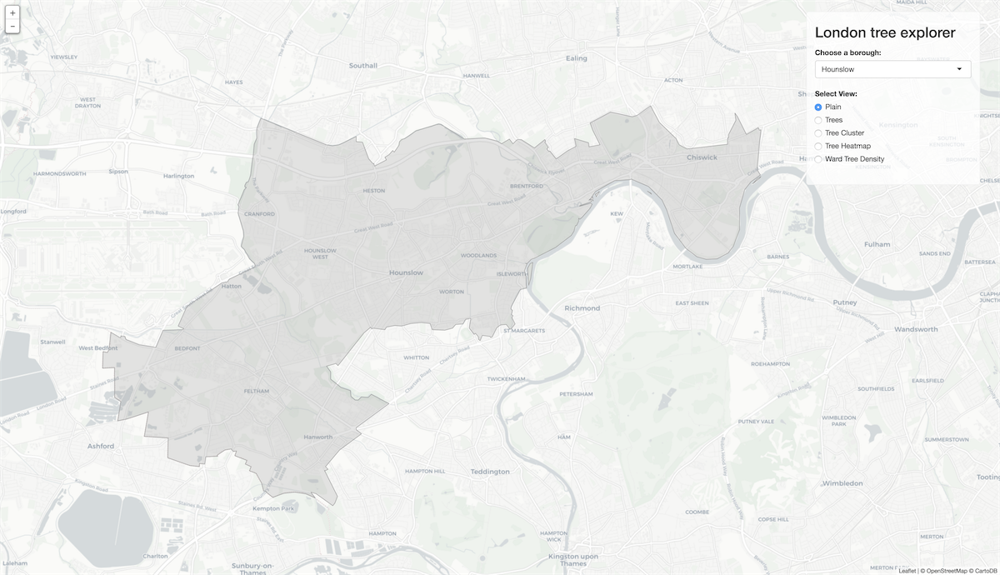
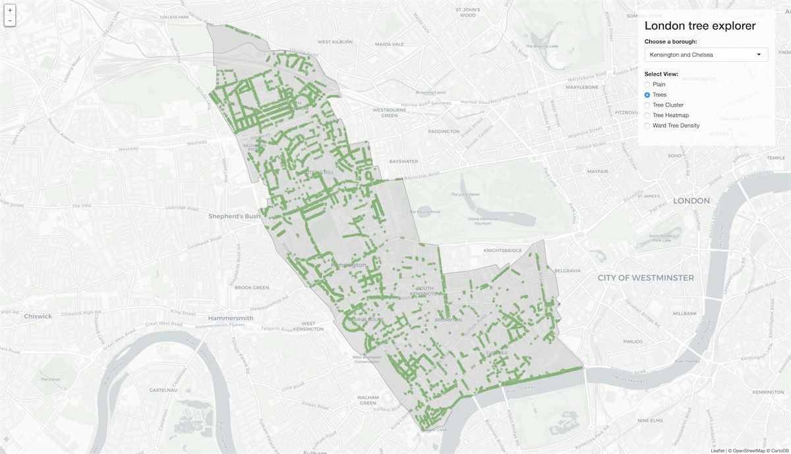
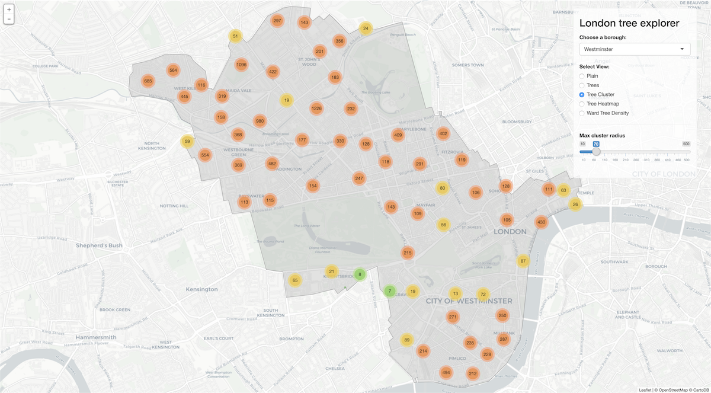
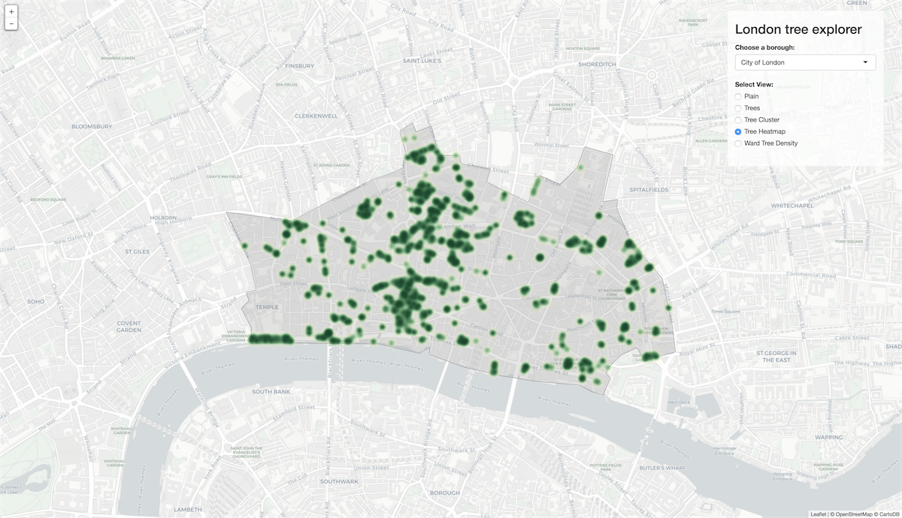
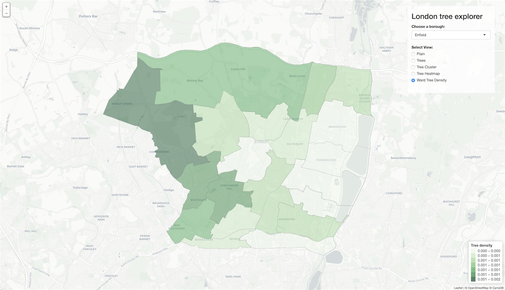

# London Tree Explorer

R Shiny toolkit for exploring urban greenery in London.

[**R Shiny App**](https://iljapanic.shinyapps.io/london-tree-explorer/) | [**Download source code**](https://github.com/iljapanic/london-tree-explorer/archive/master.zip)

*This project was created as part of the Geographic Information Systems and Science course at [MSc Smart Cities and Urban Analytics](https://www.ucl.ac.uk/prospective-students/graduate/taught/degrees/smart-cities-urban-analytics-msc) programme at the [Center for Advanced Spatial Analysis](https://www.ucl.ac.uk/bartlett/casa/) at UCL in London, UK.*

Table of contents
=================

  * [Installation](#installation)
  * [Project Structure](#project-structure)
  * Data *(coming soon)*
  * [Components](#components)
  * [Functions](#functions)
  * [Toolkit](#toolkit)
  * [Roadmap](#roadmap)
  * [Contributors](#contributors)
  * Attribution *(coming soon)*
  * License *(coming soon)*

Installation
=============

To use the toolkit locally, you need to download and install [R](https://www.r-project.org/) on your computer along with all the packages listed in ``components/packages.R``

You can install [RStudio](https://www.rstudio.com/) while you are at it. It will make your work with R much easier.

Project structure
================

**`app.R`** - pulls together and sources all the app components (this is where you initialize the app)

**`/components`** - abstracted reusable app components

**`/data`** - source data

**`deploy.R`** - function for deploying the app on [shinyapps.io](http://www.shinyapps.io/)

Data
====

*more info coming soon*

[The Local Authority Maintained Trees](https://data.london.gov.uk/dataset/local-authority-maintained-trees)

Components overview
==========

**`data-get.R`** - functions for retrieving variables and specified subsets of variables

**`data-calculate.R`** - one off functions for calculating and storing new values

**`data-load.R`** - load all the source data and store it into global variables

**`map.R`** - functions for rendering different types of maps

**`packages.R`** - import all the necessary packages

**`plot.R`** - functions for generating plots, charts and graphs

**`shiny-server.R`** - 'reactive' server configuration for the R Shiny app

**`shiny-ui.R`** - interface for the R Shiny app

 

Functions
=========

### ``data-get.R``

|  Function                     | Arguments                        |       Return             |
| :-------------              |:---------------------:            | :----------------------|
| ``getBoroughBoundary()``          |``borough``                         | SpatialPolygonsDataFrame with boundaries for a given borough  |
| ``getBoroughWards()``     | ``borough``                  |   SpatialPolygonsDataFrame with ward boundaries for a given borough |
|``getBoroughTrees()``       | ``borough``                | SpatialPointsDataFrame with trees in a given borough.  |
| ``getBoroughs()``          |NULL                         | DataFrame with data for all boroughs  |
| ``getBoroughNames()``          |NULL                         | DataFrame with data for all borough names  |
| ``getBoroughCode()``          |NULL                         | DataFrame with data for all borough codes  |
| ``getBoroughWards()``          |NULL                         | DataFrame with data for all borough wards code prefix  |
| ``getLondonWards()``          |NULL                         | SpatialPolygonsDataFrame with boundaries for all London wards  |
| ``getBoroughs()``          |NULL                         | DataFrame with data for all boroughs  |
| ``getTrees()``         |       NULL                |            SpatialPolygonsDataFrame with all the trees    |
| ``getTreesDf()``         |       NULL                |            DataFrame containing all the source tree data    |
|``getLondonWards()``        | NULL                    |  SpatialPolygonsDataFrame with boundaries for all the wards |
|``getAllLondonTrees()``       | NULL                     | SpatialPointsDataFrame with all the trees in London |
|``getAllBoroughBoundaries()``       | NULL                     | SpatialPointsDataFrame with all the borough boundaries in London |
				
 

### ``map.R``

|  Function                     | Arguments                        |       Return             |
| :-------------              |:---------------------:            | :----------------------|
| ``mapBorough()``          |``borough``                          | 'Plain' map for a given borough   |
| ``mapBoroughTrees()``     | ``borough``                  |   'Trees' map for a given borough |
| ``mapBoroughTreeClusters()``         |       ``borough``    ``dynamicInput``                |            'Tree Cluster' map for a given borough    when the value from the slider in Shiny changes, the functions runs again with the selected value    |
|``mapBoroughWardsTreeDensity()`` | ``borough``                            | 'Ward Tree Density' map showing wards and their tree density for a given borough 		                 | SpatialPointsDataFrame with all the trees.          |
|``mapBoroughTreeHeatmap()``       | ``borough``                 | 'Tree heatmap' for a given borough  
				

 

Toolkit
=======

*more info coming soon*

## 'Plain'

## 'Trees'

## 'Tree Cluster

## Tree Heatmap

## Ward Tree Density

Roadmap
=======
- [X] Improve speed and loading time
- [ ] Add Plots and Graphs
- [ ] Include park and greenspace data
- [ ] Scale the toolkit for exploring at the city level
- [ ] Implement the 'greenest route' functionality 

Contributors
=======

* Ilja Panic	- [Web](https://iljapanic.me) | [Twitter](https://twitter.com/iljapanic) | [GitHub](https://github.com/iljapanic/)

Attribution
===========

*coming soon*

License
=======

*coming soon*
